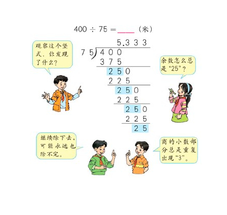

# No.166 分数到小数
<p>给定两个整数，分别表示分数的分子&nbsp;<code>numerator</code> 和分母 <code>denominator</code>，以 <strong>字符串形式返回小数</strong> 。</p>

<p>如果小数部分为循环小数，则将循环的部分括在括号内。</p>

<p class="MachineTrans-lang-zh-CN">如果存在多个答案，只需返回 <strong>任意一个</strong> 。</p>

<p class="MachineTrans-lang-zh-CN">对于所有给定的输入，<strong>保证</strong> 答案字符串的长度小于 <code>10<sup>4</sup></code> 。</p>

<p>&nbsp;</p>

<p><strong>示例 1：</strong></p>

<pre><strong>输入：</strong>numerator = 1, denominator = 2
<strong>输出：</strong>"0.5"
</pre>

<p><strong>示例 2：</strong></p>

<pre><strong>输入：</strong>numerator = 2, denominator = 1
<strong>输出：</strong>"2"
</pre>

<p><strong>示例 3：</strong></p>

<pre><strong>输入：</strong>numerator = 2, denominator = 3
<strong>输出：</strong>"0.(6)"
</pre>

<p><strong>示例 4：</strong></p>

<pre><strong>输入：</strong>numerator = 4, denominator = 333
<strong>输出：</strong>"0.(012)"
</pre>

<p><strong>示例 5：</strong></p>

<pre><strong>输入：</strong>numerator = 1, denominator = 5
<strong>输出：</strong>"0.2"
</pre>

<p>&nbsp;</p>

<p><strong>提示：</strong></p>

<ul>
	<li><code>-2<sup>31</sup> &lt;=&nbsp;numerator, denominator &lt;= 2<sup>31</sup> - 1</code></li>
	<li><code>denominator != 0</code></li>
</ul>

# 思路分析

这道题本质上就是要让我们用除法的思维去做题。  
在我们做除法的时候，怎么判断重复循环的小数呢？

首先当然是进行预处理。包括以下几个步骤。

1. 处理符号，将负号统一处理一下。因为两个正数相除显然比较符合人类的习惯。
2. 将所有32位数字输入处理成64位，因为可能会超限。
3. 处理整数部分，因为整数部分一般不参与到循环小数的范围内。
4. 其他特殊情况。


在处理完上述步骤之后，我们得到了还是题目中的两个数字`numerator`和`denominator`。这两个数字仍然是被除数与除数的关系，只不过经过减去整数部分的处理之后，我们能确保`numerator`一定小于`denominator`。


如果没有思路可以看一下上面这张图。这张图基本上概括了本题所需的循环小数部分的数学知识。
可以看出，在除法的过程中，遇到除不尽的数字，我们一般是采用余数的方式，并且继续拿余数乘10之后再除。可以确定的是，只有在余数出现相同的情况下，余数之后的情况也会一模一样，也就是说，第一次出现相同的余数就是循环节的位置。

在此处，我们使用一个哈希表来存之前出现过的所有余数，并且在第二次出现余数的时候，标注循环节的位置，结束程序。
# Rust代码
```rust
# struct Solution;
use std::collections::HashMap;
impl Solution {
    pub fn fraction_to_decimal(numerator: i32, denominator: i32) -> String {
        let mut ret = String::new();
        if (numerator as i64 * denominator as i64) < 0 {
            ret.push('-');
        }
        let mut denominator = (denominator as i64).abs();
        let mut numerator = (numerator as i64).abs();
        let pre = numerator / denominator;
        numerator %= denominator;
        let mut map: HashMap<i64, i32> = HashMap::new();
        ret.push_str(&pre.to_string());
        if numerator == 0 {
            return ret;
        }
        ret.push('.');
        let mut ws = ret.len() as i32;
        loop {
            if numerator == 0 {
                break;
            }
            if map.contains_key(&numerator) {
                ret.insert(*map.get(&numerator).unwrap() as usize, '(');
                ret.push(')');
                break;
            }
            map.insert(numerator, ws);
            numerator *= 10;
            ret.push((('0' as u8) + (numerator / denominator) as u8) as char);
            numerator %= denominator;
            ws += 1;
        }
        ret
    }
}
```
